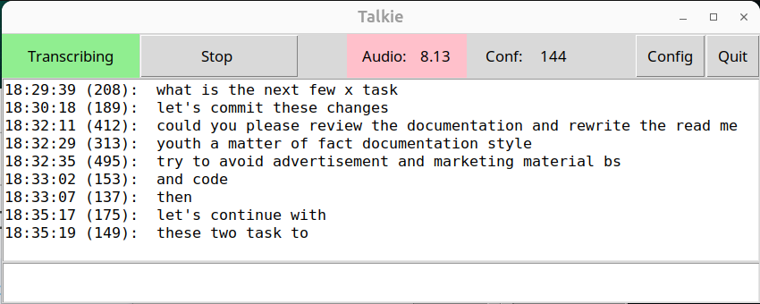

<h1 style="display: flex; align-items: center;"> Talkie - Chat with your Linux desktop</h1>
Real-time speech-to-text transcription with keyboard simulation for Linux.

## Description


Talkie is a speech recognition application that transcribes audio input and simulates keyboard events to inject text into the active window. It runs continuously in the background with a Tk-based control interface.

The application monitors microphone input, performs voice activity detection, transcribes speech using configurable recognition engines, and types the results via the Linux uinput subsystem.
<br clear="right"/>

## Features

- Real-time audio transcription
- Multiple speech recognition engines (Vosk, Sherpa-ONNX, Faster-Whisper)
- Voice activity detection with configurable thresholds
- Keyboard event simulation via uinput
- Text preprocessing (punctuation commands, number conversion)
- External control via file-based IPC
- Persistent JSON configuration
- Single-instance enforcement

## Architecture

```
src/
├── talkie.tcl          # Main application entry point
├── config.tcl          # Configuration management
├── engine.tcl          # Speech engine with integrated audio (worker thread)
├── audio.tcl           # Result parsing and transcription state
├── worker.tcl          # Reusable worker thread abstraction
├── output.tcl          # Keyboard output (worker thread)
├── threshold.tcl       # Confidence threshold management
├── textproc.tcl        # Text preprocessing and voice commands
├── coprocess.tcl       # External engine communication
├── ui-layout.tcl       # Tk interface
├── display.tcl         # Text display and visualization
├── vosk.tcl            # Vosk engine bindings
├── gec/                # Grammar/Error Correction pipeline
│   ├── gec.tcl         # GEC coordinator
│   ├── pipeline.tcl    # ONNX inference pipeline
│   ├── punctcap.tcl    # Punctuation and capitalization
│   ├── homophone.tcl   # Homophone correction
│   └── tokens.tcl      # BERT token constants
├── pa/                 # PortAudio critcl bindings
├── audio/              # Audio processing critcl bindings
├── vosk/               # Vosk critcl bindings
├── uinput/             # uinput critcl bindings
└── engines/            # External engine wrappers
```

### Threading Architecture

Audio processing runs on a dedicated worker thread, eliminating the main thread from the critical audio path:

```
┌─────────────────────────────────────────────────────────────────┐
│                        Main Thread                               │
│  ┌─────────┐  ┌─────────┐  ┌─────────┐  ┌─────────────────────┐ │
│  │   GUI   │  │  GEC    │  │ Display │  │ Result Processing   │ │
│  │ (5Hz)   │  │Pipeline │  │         │  │ (parse_and_display) │ │
│  └─────────┘  └─────────┘  └─────────┘  └─────────────────────┘ │
└─────────────────────────────────────────────────────────────────┘
        ▲                                          ▲
        │ thread::send -async                      │
        │ (UI updates)                             │ thread::send -async
        │                                          │ (recognition results)
┌───────┴─────────────────────────┐  ┌─────────────┴───────────────┐
│      Engine Worker Thread       │  │     Output Worker Thread    │
│  ┌──────────────────────────┐  │  │  ┌───────────────────────┐  │
│  │   PortAudio Callbacks    │  │  │  │   uinput Keyboard     │  │
│  │   (25ms chunks, 40Hz)    │  │  │  │   Simulation          │  │
│  └────────────┬─────────────┘  │  │  └───────────────────────┘  │
│               ▼                 │  │                             │
│  ┌──────────────────────────┐  │  └─────────────────────────────┘
│  │  Threshold Detection     │  │
│  │  (adaptive noise floor)  │  │
│  └────────────┬─────────────┘  │
│               ▼                 │
│  ┌──────────────────────────┐  │
│  │  Vosk Recognition        │  │
│  │  (or coprocess engine)   │  │
│  └──────────────────────────┘  │
└─────────────────────────────────┘
```

**Data Flow:**
1. PortAudio delivers 25ms audio chunks directly to engine worker thread
2. Worker performs threshold detection and Vosk processing
3. Recognition results sent to main thread for GEC processing
4. Processed text sent to output worker for keyboard simulation
5. UI updates throttled to 5Hz to reduce overhead

### Component Overview

**talkie.tcl**: Application initialization, single-instance enforcement, module loading

**config.tcl**: JSON configuration file management (~/.talkie.conf), file watching for external state changes (~/.talkie)

**engine.tcl**: Integrates PortAudio stream on worker thread. Audio callbacks fire directly on worker, bypassing main thread. Handles threshold detection and speech recognition.

**audio.tcl**: Parses recognition results (JSON from Vosk), coordinates GEC processing, manages transcription state, device enumeration.

**worker.tcl**: Reusable worker thread abstraction using Tcl Thread package. Provides create, send, send_async, exists, destroy operations.

**output.tcl**: Keyboard simulation via uinput on dedicated worker thread. Async text output to avoid blocking main thread.

**gec/**: Grammar Error Correction pipeline using ONNX Runtime for BERT model inference. Adds punctuation, capitalization, and corrects homophones.

**textproc.tcl**: Punctuation command processing, text normalization

**ui-layout.tcl**: Tk GUI with transcription controls, real-time displays (5Hz updates), parameter adjustment

## Dependencies

### System Requirements
- Linux kernel with uinput support
- Tcl/Tk 8.6 or later
- PortAudio or PulseAudio
- User must be member of `input` group for uinput access

### Tcl Packages
- Tk - GUI framework
- Thread - Worker thread management
- json - JSON parsing/generation
- jbr::unix - Unix utilities
- jbr::filewatch - File monitoring
- pa - PortAudio bindings (critcl)
- audio - Audio energy calculation (critcl)
- uinput - Keyboard simulation (critcl)
- vosk - Vosk speech engine (critcl)

### Speech Engine Models
Download and place in `models/` directory:
- Vosk: vosk-model-en-us-0.22-lgraph
- Sherpa-ONNX: compatible ONNX models
- Faster-Whisper: CTranslate2 models

## Installation

### 1. Build critcl Bindings
```bash
cd src
make build
```

This compiles the PortAudio, audio processing, uinput, and Vosk critcl packages.

### 2. Configure uinput Access
```bash
# Load uinput kernel module
sudo modprobe uinput

# Add permanent loading (optional)
echo "uinput" | sudo tee /etc/modules-load.d/uinput.conf

# Add user to input group
sudo usermod -a -G input $USER

# Logout and login for group membership to take effect
```

### 3. Download Speech Models
Download the appropriate model files for your chosen engine and place them in the `models/` directory.

For Vosk:
```bash
mkdir -p models/vosk
cd models/vosk
wget https://alphacephei.com/vosk/models/vosk-model-en-us-0.22-lgraph.zip
unzip vosk-model-en-us-0.22-lgraph.zip
```

## Usage

### Starting the Application
```bash
cd src
./talkie.sh
```

The GUI window will appear. Only one instance can run at a time; additional launches will raise the existing window.

### Command-Line Interface
```bash
./talkie.sh start       # Enable transcription
./talkie.sh stop        # Disable transcription
./talkie.sh toggle      # Toggle transcription state
./talkie.sh state       # Display current state
```

### External Control
Transcription state can be controlled by modifying `~/.talkie`:
```bash
echo '{"transcribing": true}' > ~/.talkie   # Start transcription
echo '{"transcribing": false}' > ~/.talkie  # Stop transcription
```

The application monitors this file and updates state within 500ms.

### Voice Commands
During transcription, speak these commands to insert punctuation:
- "period" → .
- "comma" → ,
- "question mark" → ?
- "exclamation mark" → !
- "colon" → :
- "semicolon" → ;
- "new line" → \n
- "new paragraph" → \n\n

Spoken numbers are converted to digits: "twenty five" → "25"

## Configuration

Configuration file: `~/.talkie.conf` (JSON format)

### Default Settings
```json
{
    "sample_rate": 44100,
    "frames_per_buffer": 4410,
    "energy_threshold": 5.0,
    "confidence_threshold": 200.0,
    "device": "pulse",
    "speech_engine": "vosk",
    "silence_trailing_duration": 0.5,
    "lookback_seconds": 1.0,
    "vosk_max_alternatives": 0,
    "vosk_beam": 20,
    "vosk_lattice_beam": 8
}
```

### Parameters

**sample_rate**: Audio sample rate in Hz (typically 44100 or 16000)

**frames_per_buffer**: Audio buffer size in frames

**energy_threshold**: Voice activity detection threshold (0-100)

**confidence_threshold**: Minimum recognition confidence for output (0-400)

**device**: PortAudio device identifier ("pulse" or device name)

**speech_engine**: Recognition engine ("vosk", "sherpa", or "faster-whisper")

**silence_trailing_duration**: Silence duration before finalizing utterance (seconds)

**lookback_seconds**: Pre-speech audio buffer duration (seconds)

**vosk_max_alternatives**: Number of recognition alternatives (0-5)

**vosk_beam**: Beam search width for Vosk (5-50)

**vosk_lattice_beam**: Lattice beam width for Vosk (1-20)

All parameters can be adjusted via the GUI or by editing the configuration file directly.

## Performance

### Audio Processing
- **Sample Rate**: 16kHz (device native rate)
- **Chunk Size**: 25ms (~400 frames at 16kHz)
- **Callback Rate**: 40Hz on engine worker thread
- **Latency**: ~50-100ms speech detection response
- **Lookback**: Configurable pre-speech audio buffering (default 1.0s)

### Threading Benefits
- **No Main Thread Blocking**: Audio processing on dedicated worker
- **Reduced Latency**: Direct path from audio to recognition
- **UI Responsiveness**: GUI never waits for audio processing
- **Throttled Updates**: UI refreshes at 5Hz, not 40Hz

## Development

### Building Components
```bash
# Build all critcl packages
make build

# Build specific package
cd src/pa && make
cd src/audio && make
cd src/uinput && make
cd src/vosk && make
```

### Adding a Speech Engine
1. Add entry to `engine_registry` in `src/engine.tcl`
2. For coprocess engines: create wrapper script in `src/engines/`
3. For critcl engines: create package directory with critcl code and Tcl interface

### Testing
Run the application with console output visible:
```bash
cd src
./talkie.tcl 2>&1 | tee talkie.log
```

## Troubleshooting

### uinput Permission Denied
```
ERROR: Cannot write to /dev/uinput
```
Verify user is in `input` group and has logged out/in:
```bash
groups | grep input
```

**Void Linux**: The `/dev/uinput` device needs group permissions set:
```bash
# Quick fix (temporary)
make fix-uinput

# Permanent fix: install runit service
make install-uinput-service
```

### uinput Device Not Found
```
ERROR: /dev/uinput device not found
```
Load the uinput kernel module:
```bash
sudo modprobe uinput
```

### Audio Device Errors
List available audio devices and update configuration:
```bash
pactl list sources short  # For PulseAudio systems
```

### Speech Engine Model Not Found
Verify model path in configuration matches actual model location in `models/` directory.

## License

MIT

## Author

john@rkroll.com
