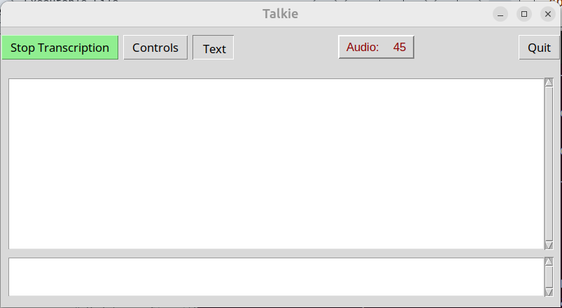

<h1 style="display: flex; align-items: center;"> Talkie - Voice-to-keyboard for Linux</h1>

Real-time speech-to-text transcription with keyboard simulation for Linux.

## Description


Talkie is a speech recognition application that transcribes audio input and simulates keyboard events to inject text into the active window. It runs continuously in the background with a Tk-based control interface.

The application monitors microphone input, performs voice activity detection, transcribes speech using configurable recognition engines, applies grammar error correction (punctuation, capitalization, homophones), and types the results via the Linux uinput subsystem.
<br clear="right"/>

## Features

- Real-time audio transcription
- Multiple speech recognition engines (Vosk, Sherpa-ONNX, Faster-Whisper)
- Voice activity detection with configurable threshold and spike suppression
- Grammar error correction (GEC) with Intel NPU acceleration
  - Punctuation and capitalization restoration (DistilBERT)
  - Homophone correction (ELECTRA masked language modeling)
  - Grammar correction (T5/CTranslate2, optional)
- Keyboard event simulation via uinput
- Voice command macro system (punctuation, symbols, formatting)
- External control via file-based IPC
- Persistent JSON configuration with XDG support
- Single-instance enforcement (TCP socket on port 47823)
- Feedback logging for STT correction analysis
- Automatic audio stream health monitoring and recovery

## Architecture

```
src/
├── talkie.tcl          # Main application entry point
├── talkie.sh           # Startup script (handles OpenVINO paths, CLI)
├── config.tcl          # Configuration management
├── engine.tcl          # Audio capture + speech processing workers
├── audio.tcl           # Result display, transcription state, device enumeration
├── worker.tcl          # Reusable worker thread abstraction
├── output.tcl          # Keyboard output (worker thread)
├── gec_worker.tcl      # GEC pipeline (worker thread)
├── textproc.tcl        # Macro-based text preprocessing and voice commands
├── threshold.tcl       # Confidence threshold filtering
├── coprocess.tcl       # External engine communication (stdin/stdout)
├── ui-layout.tcl       # Tk interface
├── feedback.tcl        # Unified feedback logging for correction analysis
├── vosk.tcl            # Vosk engine bindings
├── gec/                # Grammar Error Correction
│   ├── gec.tcl         # OpenVINO critcl bindings (C code)
│   ├── ct2.tcl         # CTranslate2 critcl bindings for T5 grammar (C++)
│   ├── pipeline.tcl    # GEC pipeline orchestration
│   ├── punctcap.tcl    # Punctuation and capitalization module
│   ├── homophone.tcl   # Homophone correction module
│   ├── grammar.tcl     # Grammar correction (T5-based)
│   ├── tokens.tcl      # BERT vocabulary constants
│   └── vocab.txt       # BERT vocabulary file
├── pa/                 # PortAudio critcl bindings
├── audio/              # Audio energy calculation critcl bindings
├── vosk/               # Vosk critcl bindings
├── uinput/             # uinput critcl bindings
├── wordpiece/          # WordPiece tokenizer critcl bindings (for GEC)
├── sherpa-onnx/        # Sherpa-ONNX critcl bindings
├── engines/            # External engine wrappers (Sherpa, Faster-Whisper)
└── tests/              # Test suite (tcltest)
```

### Threading Architecture

Audio processing is fully decoupled from the main thread through a multi-worker architecture:

```
┌─────────────────────────────────────────────────────────────────┐
│                        Main Thread                               │
│  ┌──────────────────────┐  ┌─────────────────────────────────┐  │
│  │   Tk GUI (5Hz)       │  │   Result Display                │  │
│  │   - Controls         │  │   - final_text(), partial_text()│  │
│  │   - Audio level bar  │  │   - Timing info display         │  │
│  └──────────────────────┘  └─────────────────────────────────┘  │
└─────────────────────────────────────────────────────────────────┘
        ▲                                ▲
        │ thread::send -async            │ thread::send -async
        │ (UI updates)                   │ (display notifications)
        │                                │
┌───────┴───────────────┐  ┌─────────────┴───────────────────────┐
│   Audio Worker        │  │         GEC Worker                   │
│  ┌─────────────────┐  │  │  ┌───────────────────────────────┐  │
│  │ PortAudio       │──┼──│─▶│  Homophone Correction (ELECTRA)│  │
│  │ Callbacks (40Hz)│  │  │  │  Punctuation/Caps (DistilBERT) │  │
│  └─────────────────┘  │  │  │  Grammar (T5, optional)        │  │
└───────────────────────┘  │  └───────────────┬───────────────┘  │
        │                  └──────────────────┼───────────────────┘
        │ thread::send -async                 │ thread::send -async
        ▼                                     ▼
┌───────────────────────────┐  ┌─────────────────────────────────┐
│   Processing Worker       │  │      Output Worker              │
│  ┌─────────────────────┐  │  │  ┌───────────────────────────┐  │
│  │ VAD (fixed threshold)│  │  │  │   uinput Keyboard         │  │
│  │ Vosk Recognition    │──┼──│  │   Simulation              │  │
│  │ (or coprocess)      │  │  │  └───────────────────────────┘  │
│  └─────────────────────┘  │  └─────────────────────────────────┘
└───────────────────────────┘

Pipeline: Audio → Processing → GEC → Output
                                └──▶ Main (display)
```

**Data Flow:**
1. **Audio Worker**: PortAudio delivers 25ms chunks, queues to Processing (never blocks). Stale chunks (>500ms old) are dropped to prevent backlog after suspend/idle.
2. **Processing Worker**: VAD threshold detection + speech recognition. Requires 3 consecutive chunks (~75ms) above threshold to start a segment.
3. **GEC Worker**: Confidence filtering, grammar correction via OpenVINO (Intel NPU accelerated), textproc macros
4. **Output Worker**: Keyboard simulation via uinput
5. **Main Thread**: GUI updates throttled to 5Hz

### Component Overview

**talkie.tcl**: Application initialization, single-instance enforcement (TCP socket), module loading

**talkie.sh**: Startup script that sets up OpenVINO/NPU library paths and provides CLI commands

**config.tcl**: JSON configuration file management (`$XDG_CONFIG_HOME/talkie.conf` or `~/.talkie.conf`), file watching for external state changes (`~/.talkie`), variable traces for hot-swapping engines/devices

**engine.tcl**: Creates two worker threads — Audio Worker (captures audio, queues to processing) and Processing Worker (VAD, speech recognition). Includes health monitoring to detect and recover from frozen audio streams, with awareness of DPMS display sleep.

**audio.tcl**: Display callbacks for results, transcription state management, audio device enumeration

**gec_worker.tcl**: Dedicated worker thread for grammar error correction pipeline. Receives final results from Processing, applies confidence filtering, runs GEC, applies textproc macros, sends to Output.

**worker.tcl**: Reusable worker thread abstraction using Tcl Thread package. Provides create, send, send_async, exists, destroy, tid operations.

**output.tcl**: Keyboard simulation via uinput on dedicated worker thread.

**textproc.tcl**: Macro-based voice command processing loaded from `talkie.map`. Handles punctuation insertion, symbol entry, spacing rules, and sentence capitalization tracking.

**threshold.tcl**: Confidence threshold filtering — rejects recognition results below the configured threshold.

**gec/**: Grammar Error Correction using OpenVINO for neural inference (Intel NPU accelerated):
- `gec.tcl` — OpenVINO critcl bindings (C code)
- `ct2.tcl` — CTranslate2 critcl bindings for T5 grammar correction (C++)
- `pipeline.tcl` — GEC orchestration (homophone → punctcap → grammar)
- `punctcap.tcl` — DistilBERT for punctuation/capitalization
- `homophone.tcl` — ELECTRA for homophone correction
- `grammar.tcl` — T5 grammar correction (optional, CPU via CTranslate2)

**wordpiece/**: WordPiece tokenizer (critcl C implementation) used by the GEC pipeline for BERT/ELECTRA tokenization.

**feedback.tcl**: Unified feedback logging to `~/.config/talkie/feedback.jsonl`. Captures GEC corrections and text injections.

**ui-layout.tcl**: Tk GUI with transcription controls, real-time displays (5Hz updates), parameter adjustment

## Dependencies

### System Requirements
- Linux kernel with uinput support
- Tcl/Tk 8.6 or later
- PortAudio
- User must be member of `input` group for uinput access

### For GEC (Grammar Error Correction)
- Intel CPU with NPU (e.g., Core Ultra series) — optional, falls back to CPU
- OpenVINO (built from source with NPU support)
- Intel NPU driver (linux-npu-driver)

### For T5 Grammar Correction (optional)
- CTranslate2
- SentencePiece

### Tcl Packages
- Tk — GUI framework
- Thread — Worker thread management
- json — JSON parsing/generation
- jbr::unix — Unix utilities
- jbr::filewatch — File monitoring
- jbr::pipe — Pipe utilities (used by textproc)
- pa — PortAudio bindings (critcl)
- audio — Audio energy calculation (critcl)
- uinput — Keyboard simulation (critcl)
- vosk — Vosk speech engine (critcl)
- wordpiece — WordPiece tokenizer (critcl)
- gec — OpenVINO inference bindings (critcl)

### Speech Engine Models
Download and place in `models/` directory:
- **Vosk**: `models/vosk/vosk-model-en-us-0.22-lgraph`
- **Sherpa-ONNX**: `models/sherpa-onnx/` (streaming transducer models)
- **Faster-Whisper**: `models/faster-whisper/` (CTranslate2 models)

### GEC Models
Place in `models/gec/`:
- `distilbert-punct-cap.onnx` — Punctuation and capitalization
- `electra-small-generator.onnx` — Homophone correction
- `t5-grammar-ct2/` — T5 grammar correction (optional, CTranslate2 format)

### Data Files
- `data/homophones.json` — Homophone groups (generated from pronunciation dictionary)
- `talkie.map` — Voice command macro definitions

## Installation

### 1. Build critcl Bindings
```bash
cd src
make build
```

This compiles the PortAudio, audio processing, uinput, Vosk, WordPiece, and GEC critcl packages.

Individual packages:
```bash
cd src/pa && make       # PortAudio bindings
cd src/audio && make    # Audio energy calculation
cd src/uinput && make   # Keyboard simulation
cd src/vosk && make     # Vosk speech recognition
cd src/wordpiece && make # WordPiece tokenizer
cd src/gec && make      # OpenVINO GEC inference
```

### 2. Configure uinput Access
```bash
# Load uinput kernel module
sudo modprobe uinput

# Add permanent loading (optional)
echo "uinput" | sudo tee /etc/modules-load.d/uinput.conf

# Add user to input group
sudo usermod -a -G input $USER

# Logout and login for group membership to take effect
```

### 3. Download Speech Models
Download the appropriate model files for your chosen engine and place them in the `models/` directory.

For Vosk:
```bash
mkdir -p models/vosk
cd models/vosk
wget https://alphacephei.com/vosk/models/vosk-model-en-us-0.22-lgraph.zip
unzip vosk-model-en-us-0.22-lgraph.zip
```

## Usage

### Starting the Application
```bash
cd src
./talkie.sh
```

The GUI window will appear. Only one instance can run at a time; additional launches will raise the existing window.

The startup script automatically configures OpenVINO library paths for GEC inference and pins to P-cores on Intel hybrid CPUs.

### Command-Line Interface
```bash
./talkie.sh start       # Enable transcription (and mute audio if slim available)
./talkie.sh stop        # Disable transcription (and unmute audio)
./talkie.sh toggle      # Toggle transcription state
./talkie.sh state       # Display current state as JSON
./talkie.sh --help      # Show help
```

### External Control
Transcription state can be controlled by modifying `~/.talkie`:
```bash
echo '{"transcribing": true}' > ~/.talkie   # Start transcription
echo '{"transcribing": false}' > ~/.talkie  # Stop transcription
```

The application monitors this file and updates state within 500ms.

### Voice Commands
During transcription, speak these commands to insert punctuation and symbols. Commands are defined in `talkie.map` and processed by `textproc.tcl`.

**Sentence endings** (end of utterance only):
| Spoken | Output |
|--------|--------|
| "period" | `.` |
| "question mark" | `?` |
| "exclamation mark" / "exclamation point" | `!` |

**Line breaks** (end of utterance only):
| Spoken | Output |
|--------|--------|
| "new line" / "newline" | `\n` |
| "new paragraph" | `\n\n` |

**Mid-sentence punctuation**:
| Spoken | Output |
|--------|--------|
| "comma" | `,` |
| "colon" | `:` |
| "semicolon" / "semi colon" | `;` |
| "ellipsis" | `...` |

**Connectors** (no space on either side):
| Spoken | Output |
|--------|--------|
| "hyphen" / "dash" | `-` |
| "apostrophe" | `'` |

**Quotes and brackets**:
| Spoken | Output |
|--------|--------|
| "open quote" | `"` |
| "close quote" | `"` |
| "open paren" | `(` |
| "close paren" | `)` |

**Symbols**:
| Spoken | Output |
|--------|--------|
| "at sign" | `@` |
| "hashtag" / "pound sign" | `#` |
| "dollar sign" | `$` |
| "asterisk" | `*` |
| "slash" | `/` |
| "underscore" | `_` |
| "ampersand" | `&` |
| "percent" | `%` |
| "plus sign" | `+` |
| "equals" | `=` |
| "less than" | `<` |
| "greater than" | `>` |

## Configuration

Configuration file: `$XDG_CONFIG_HOME/talkie.conf` or `~/.talkie.conf` (JSON format, auto-saved on change)

### Default Settings
```json
{
    "speech_engine": "vosk",
    "input_device": "default",
    "audio_threshold": 25.0,
    "silence_seconds": 0.3,
    "min_duration": 0.30,
    "lookback_seconds": 0.5,
    "spike_suppression_seconds": 0.3,
    "confidence_threshold": 100,
    "max_confidence_penalty": 75,
    "vosk_modelfile": "vosk-model-en-us-0.22-lgraph",
    "vosk_beam": 10,
    "vosk_lattice": 5,
    "sherpa_modelfile": "sherpa-onnx-streaming-zipformer-en-2023-06-26",
    "sherpa_max_active_paths": 4,
    "faster_whisper_modelfile": "",
    "gec_homophone": 1,
    "gec_punctcap": 1,
    "gec_grammar": 0,
    "typing_delay_ms": 5
}
```

### Parameters

**speech_engine**: Recognition engine (`"vosk"`, `"sherpa"`, or `"faster-whisper"`)

**input_device**: Audio input device name (`"default"` or specific device name)

**audio_threshold**: Voice activity detection threshold (0–100). Audio energy above this level is considered speech.

**silence_seconds**: Silence duration before finalizing an utterance (seconds)

**min_duration**: Minimum speech duration to accept (seconds). Shorter segments are discarded.

**lookback_seconds**: Pre-speech audio buffer duration (seconds). Audio before the VAD trigger is included in the utterance.

**spike_suppression_seconds**: Cooldown period after a segment ends before a new one can start (prevents noise spikes)

**confidence_threshold**: Minimum recognition confidence for output (0–100). Results below this are discarded.

**max_confidence_penalty**: Maximum confidence penalty applied based on utterance characteristics (0–100)

**vosk_beam**: Beam search width for Vosk (higher = more accurate, slower)

**vosk_lattice**: Lattice beam width for Vosk

**sherpa_modelfile**: Sherpa-ONNX model directory name (under `models/sherpa-onnx/`)

**sherpa_max_active_paths**: Beam search paths for Sherpa-ONNX (default 4)

**faster_whisper_modelfile**: Faster-Whisper model directory name (under `models/faster-whisper/`)

**gec_homophone**: Enable homophone correction (0/1)

**gec_punctcap**: Enable punctuation and capitalization (0/1)

**gec_grammar**: Enable T5-based grammar correction (0/1, experimental, requires CTranslate2)

**typing_delay_ms**: Delay between keystrokes when simulating typing

Sample rate and buffer size are automatically detected from the audio device (~16kHz, 25ms chunks).

All parameters can be adjusted via the GUI or by editing the configuration file directly. Config changes take effect immediately via variable traces; engine and model changes trigger a hot-swap without restarting the application.

## Feedback Logging

Talkie logs events to `~/.config/talkie/feedback.jsonl` in JSON Lines format for analyzing STT accuracy.

### Event Types

| Type | Description | Fields |
|------|-------------|--------|
| `gec` | GEC correction applied | `input`, `output` |
| `inject` | Text sent to uinput | `text` |

### Example Log Entries

```jsonl
{"ts":1705500000000,"type":"gec","input":"their going","output":"they're going"}
{"ts":1705500000050,"type":"inject","text":"they're going"}
```

### Analyzing Corrections

View GEC corrections:
```bash
jq 'select(.type == "gec")' ~/.config/talkie/feedback.jsonl
```

## Performance

### Audio Processing
- **Sample Rate**: 16kHz (detected from device)
- **Chunk Size**: 25ms (~400 frames at 16kHz)
- **Callback Rate**: 40Hz on audio worker thread
- **VAD**: Fixed threshold with spike suppression; requires 3 consecutive chunks (~75ms) to start a segment
- **Lookback**: Configurable pre-speech audio buffering (default 0.5s)
- **Backlog protection**: Stale chunks (>500ms) are dropped to recover from suspend/idle

### GEC Processing (Intel NPU)
- **Homophone correction**: 20–50ms per phrase
- **Punctuation/capitalization**: 8–15ms per phrase
- **Total GEC**: 30–65ms per phrase
- Falls back to CPU automatically if NPU is unavailable

### Threading Benefits
- **Decoupled Audio**: Audio capture never blocks on recognition
- **Pipeline Architecture**: Audio → Processing → GEC → Output
- **UI Responsiveness**: GUI updates throttled to 5Hz
- **Health Monitoring**: Detects and recovers from frozen audio streams; skips restarts when DPMS display sleep is active

## Development

### Building Components
```bash
cd src
make build    # Build all critcl packages
```

### Adding a Speech Engine
1. Add entry to `engine_registry` in `src/engine.tcl`
2. For coprocess engines: create wrapper script in `src/engines/`
3. For critcl engines: create package directory with critcl code and Tcl interface

### Adding Voice Commands
Edit `talkie.map` at the project root. Format:
```
"spoken phrase"   "output"   [attachment]
```
Attachment options: `<` (attach to left), `>` (attach to right), `<>` (both), omit for normal spacing. Append `$` to the pattern to match end-of-utterance only.

### Running Tests
```bash
cd src/tests
tclsh all_tests.tcl
```

Debug output (run with console output visible):
```bash
cd src
./talkie.sh 2>&1 | tee talkie.log
```

Debug output shows VAD state, segment timing, confidence filtering, and GEC processing times.

## Troubleshooting

### uinput Permission Denied
```
ERROR: Cannot write to /dev/uinput
```
Verify user is in `input` group and has logged out/in:
```bash
groups | grep input
```

**Void Linux**: The `/dev/uinput` device needs group permissions set:
```bash
# Quick fix (temporary)
make fix-uinput

# Permanent fix: install runit service
make install-uinput-service
```

### uinput Device Not Found
```
ERROR: /dev/uinput device not found
```
Load the uinput kernel module:
```bash
sudo modprobe uinput
```

### Audio Device Errors
List available audio devices and update configuration:
```bash
pactl list sources short  # For PulseAudio systems
```

### NPU Not Detected
Check available inference devices:
```tcl
package require gec
puts [gec::devices]  ;# Should show: CPU NPU
```

If only CPU is shown:
1. Verify `/dev/accel0` exists
2. Check user is in `video` group
3. Ensure `LD_LIBRARY_PATH` includes both OpenVINO and NPU driver library paths (set automatically by `talkie.sh`)

### Speech Engine Model Not Found
Verify model path in configuration matches actual model location in `models/` directory.

## License

MIT

## Author

john@rkroll.com
